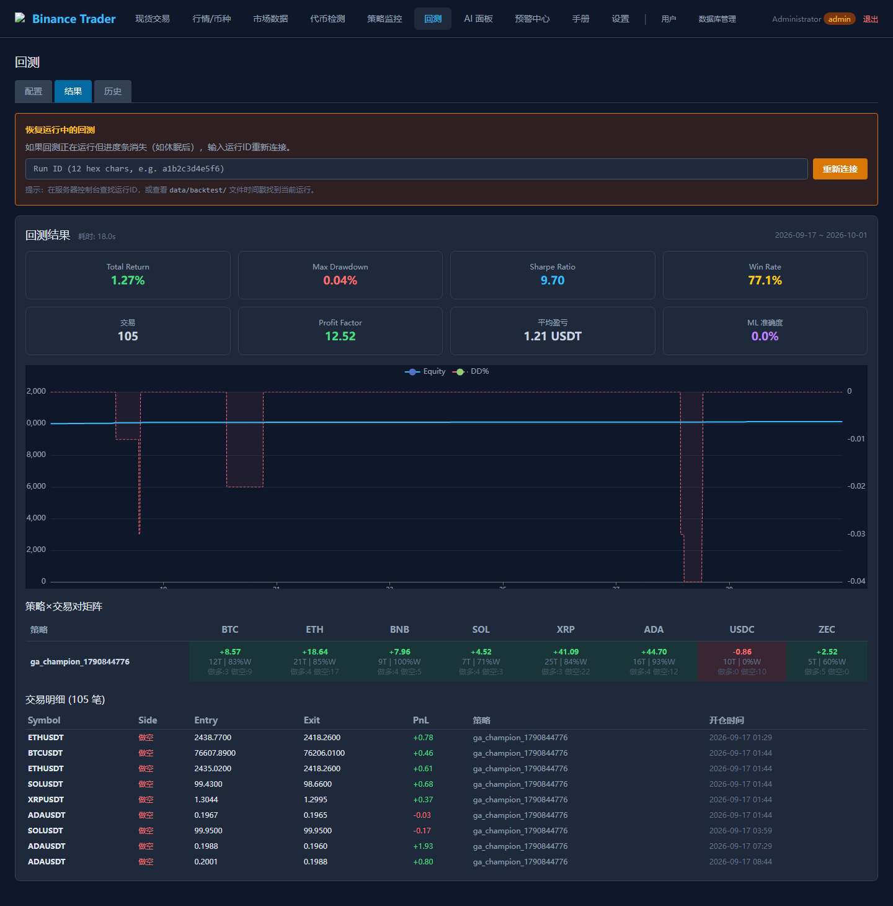
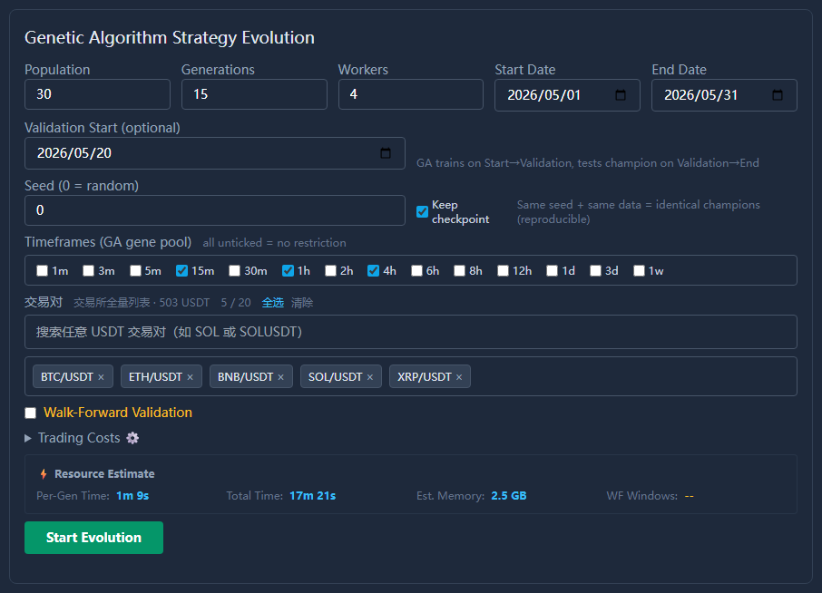
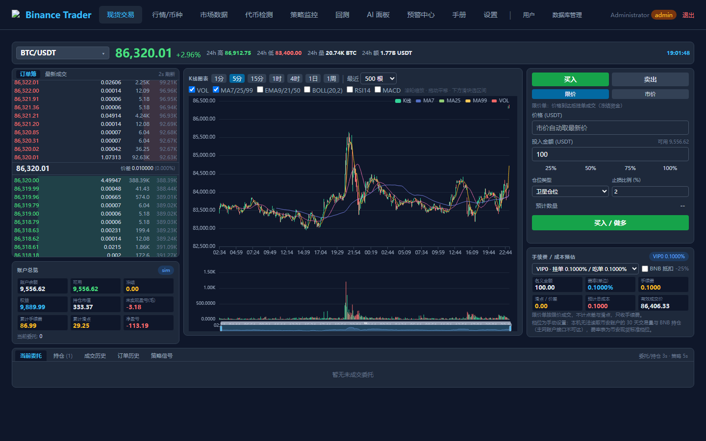
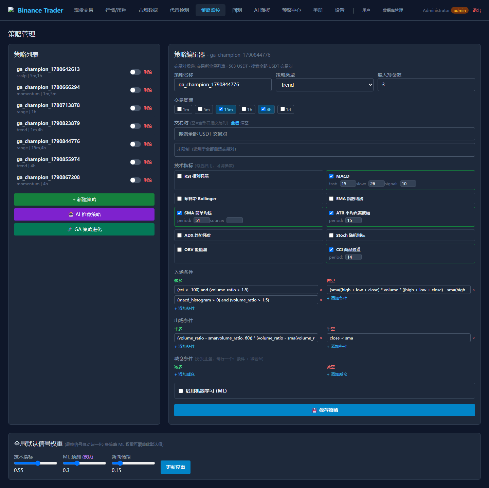
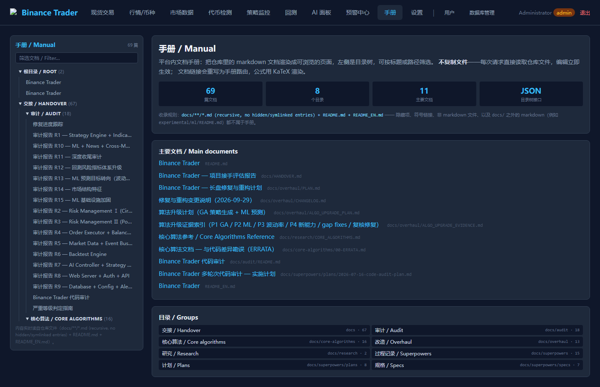
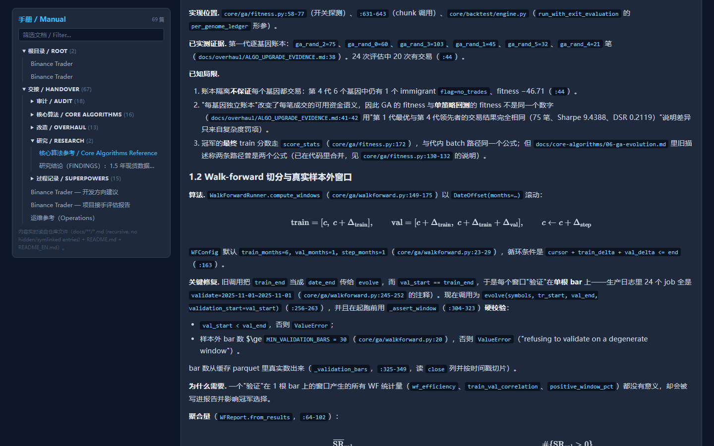

# Binance Trader

**中文** · [English](README_EN.md)

面向币安现货的 Python 3.12 加密交易策略研究与测量平台。数据管道把公开行情落成本地 parquet 缓存并检查缺口，回测引擎按手续费、价差与滑点建模，遗传搜索（GA）演化策略，ML 与 GA 各有一套可信度门，FastAPI + ECharts 的 Web 控制台把行情、下单、回测、GA 进度放在同一批页面里，`/manual` 把仓库里的 markdown 当站内手册读。

`VERSION` 2.0.1 · Python 3.12（实测 3.12.10）· Windows / Linux · 默认只监听 `127.0.0.1:8899`。所有交易能力以关闭状态出货，默认 `--mode sim` 在本地模拟成交。

---

## 研究警告

这是一个研究与测量平台，里面没有任何一个策略经过实盘验证。六条独立搜索线在 1.5 年现货缓存（2025-04-01 ~ 2026-10-01）上都没有找到稳健的样本外优势：ML 门控、配对协整、meta-labeling、遗传算法、P7 行情状态与上层编排、P8 波动率目标化——没有一条通过它自己事先声明的门。

最直观的一组数字：七个出货冠军在四个不重叠窗口上的原始收益是 −4.07 % / −2.46 % / −1.59 % / −4.91 %，年化波动率 1.2–2.8 %，它们几乎一直待在现金里。在每一个被测窗口里，对齐敞口之后"持有这个篮子"都打败了演化出来的策略。

请勿用真金白银运行本项目。它已经证明的价值是测量、风控与执行纪律，包括把 fitness 41.82 / Sharpe 9.01 / 382 笔 / 最大回撤 0.11 % 这样看起来很好的候选如实拒绝掉的能力。

完整实测报告与全部数字的出处：[`docs/research/FINDINGS.md`](docs/research/FINDINGS.md)——六条搜索线的逐项结果、每一条被自己的门槛拒绝的方式、证据的局限，以及什么会改变这个结论。

---

## 1. 环境约束（必读）

本机只有 Binance 的公开镜像可达：`https://data-api.binance.vision`（REST 行情）与 `wss://data-stream.binance.vision`（实时 K 线流）可用，`https://testnet.binance.vision` 可用于下单与账户，而 `https://api.binance.com` 会挂到超时。真实资金交易在本机不可能完成，`--mode live` 实际打到 testnet，手续费档位也只能手动设置。

行情一律走 `config.binance.market_data_host`，由 `core/market_data/data_client.py::MarketDataClient` 统管（15s 硬超时、连接池复用、失败抛 `MarketDataError`）。不要用裸 `AsyncClient.create()`：python-binance 默认打 `api.binance.com`，交易客户端必须显式传 `testnet=config.binance_testnet`。实时流还有一处刻意覆写：python-binance 的 `BinanceSocketManager` 硬编码了一个不可达的 socket 主机，`provider.py` 在创建 `bsm` 后覆写 `bsm._get_stream_url`，新增 socket 用法时不要绕过这一步。

Web 只绑 `127.0.0.1`，`app/main.py` 里没有 `--host` 参数；要从别的机器访问请用 SSH 端口转发或反向代理加 HTTPS，不要改成 `0.0.0.0` 暴露到公网。主机可达性的实测表与复现命令见 [`docs/operations.md`](docs/operations.md#1-环境约束必读)。

---

## 2. 现在能用的东西

### 数据管道

`core/market_data/provider.py` 从 `data-api.binance.vision`（REST）与 `data-stream.binance.vision`（WS）取行情，落成 `data/market/<SYM>/<tf>.parquet`，再抛 `MARKET_KLINE`。`scripts/download_history.py` 按 symbol / 周期 / 日期区间下载，`--merge` 做增量回填，`--backfill` 给已有文件补 `quote_volume` / `trade_count` 列。`scripts/check_data_integrity.py` 逐个文件报 bar 数、跨度与日历缺口，超过 1.5 × bar 长度即标 `GAP`；带缺口的序列会被波动率路径的 splice guard 拒绝，`--strict` 让脚本在有缺口时退出 1。

### 回测引擎

两套引擎共用一个评估内核。legacy（`core/backtest/engine.py`）逐 tick 遍历时间线，支持 LightGBM / TFT / PatchTST 与部分减仓条件；hybrid（`core/backtest/engine_hybrid.py`）先用 `SignalMatrixBuilder` 预生成信号矩阵再回放，不支持 ML，也不支持 `reduce_conditions`。`backtest.engine_mode: auto` 在策略数 ≥ 3 且无 ML、无减仓条件时选 hybrid，运行期异常会记 warning 并回退 legacy。legacy、hybrid 与信号矩阵三条路径在缺数据时报同一句 canonical 文案。成本模型把手续费分档、半价差与滑点作用到成交价或平仓价上，并在每次运行开始时冻结本次用到的每个 symbol 的价差，交易循环里不再做 I/O。成交口径 `backtest.fill_convention` 出厂为 `next_open`：信号仍按 `ts` 那根 bar 判定，开仓与平仓都按同一序列下一根 bar 的开盘价成交；`close`（信号那根 bar 自己的收盘价，零执行延迟）仍可显式选择，本次翻转之前记录的回测、GA 与冠军数字都是在该口径下产生的，复现它们需要显式设 `close`。



*回测页：引擎选择与成本模型参数、进度、结果与历史记录。*

### 可信度机器

GA 与 ML 的发布门都消费 `core/ga/trial_counter.py` 记下的真实试错数，它包含续跑、walk-forward 与逐币种多臂的全部评估，因此 deflated Sharpe 用的是"这轮到底试过多少变体"，例如 pooled 32 次对 per_symbol 64 次、P7-S4 的 133 次。发布门的基准由 `core/ga/benchmark.py` 提供，出货配置是 `ga.benchmark_mode: exposure_matched`：同一篮子只在策略持仓期间持有，再按策略实际投入的保证金占比加权，比满仓买入持有更能回答"这笔风险敞口有没有换来东西"。`core/ai/holdout.py` 是一次性 holdout 计数器，键是 `(holdout_id, window_start, window_end, timeframe)`，同一窗口第二次评估默认抛 `HoldoutRefusal`。

### 遗传搜索

`core/ga/evolver.py` 的 GA 支持检查点续跑：完成的运行默认保留 `<data-dir>/data/ga_checkpoint.pkl`（`ga.keep_checkpoint: true`），`resume: true` 从第 g 代继续到本次 job 的 `generations`；续跑时把检查点里的 `prior_trials` 与本次 `trials_this_run` 取最大值并入搜索账，所以清掉 `data/ga_trials.json` 也不会让 DSR 变好看；换成别的窗口续跑抛 `CheckpointWindowMismatchError`。`timeframe_pool` 字段把周期基因限制在白名单内，默认可选 `1m/5m/15m/1h/4h`，面板默认勾 `15m/1h/4h`，因为 1m 的 bar 数是 1h 的 60 倍。`symbol_mode: per_symbol` 让每个币跑自己的种群、各出一个冠军，冠军 YAML 的 `symbols` 只写它被评估过的币。



*GA 面板：逐代进度、评估次数、检查点状态与冠军门判定。*

### 因果状态缝

`core/strategy/regime_causal.py` 只接受因果 HMM 标签，样本内标签按名拒绝并抛 `InSampleRegimeLabelError`。`core/ai/orchestrator.py` 在这条缝上逐 bar 回答"某个策略现在允不允许被启用"，输入是因果状态、因果 EWMA 波动率、市场广度与策略自己的连亏记录；规则只能拦不能放行，`replay` 保证同规则加同事件流得到逐位相同的决策链。阈值出厂关闭，且不得在评估窗口上调。

### Web 控制台与手册

`web/` 是 FastAPI + Jinja2 + HTMX + Tailwind + ECharts。路由基线 121 条（`python scripts/regen_route_baseline.py --check` 报 121 / 121 / added 0 / removed 0）：120 个 HTTP 路由（GET 72 / POST 43 / DELETE 4 / PUT 1）加 1 个 WebSocket `/ws/alerts`，权威清单是 [`docs/overhaul/route-baseline.json`](docs/overhaul/route-baseline.json)。`/trade` 是现货交易页，`/market`、`/coin/{symbol}`、`/data`、`/audit` 是行情与筛查页，`/strategies`、`/backtest`、`/ai`、`/alerts`、`/settings`、`/db-manager`、`/users` 是运营页，三层角色 `admin` / `trader` / `viewer`，逐页权限见 [`docs/operations.md`](docs/operations.md#4-路由清单121)。



*交易页：K 线、盘口、下单面板、账户卡片与持仓在同一屏。*



*策略页：策略清单与 CRUD、信号融合权重、风控参数与生命周期事件。*

`/manual` 把 `docs/**/*.md` 与根 README 渲染成站内文档浏览器：目录树与筛选、页内目录、面包屑、上一篇与下一篇，文档内相对链接重写成手册路由，目标不在手册内时渲染为死链接而不是 404。渲染用 markdown-it-py（`html=False`），公式交给 KaTeX CDN，CDN 不可达时回退显示原始 LaTeX 源码。



*手册：目录树、面包屑与页内标题。*



*手册里的公式由 KaTeX 渲染，CDN 不可达时回退原始 LaTeX 源码。*

---

## 3. 快速开始

需要 Python 3.12（实测 3.12.10）。TA-Lib 要系统级预编译库，先按该库文档装好。

```bash
python -m venv .venv

# Windows PowerShell
.\.venv\Scripts\Activate.ps1
# Linux / macOS
source .venv/bin/activate

pip install -r requirements.txt

# Windows
copy config\secrets.yaml.example config\secrets.yaml
# Linux / macOS
cp config/secrets.yaml.example config/secrets.yaml
```

配置按 `config/config.yaml` → `config/risk_params.yaml` → `config/secrets.yaml` 顺序深合并，环境变量优先级最高。全部配置键、密钥写法和 GA job 字段见 [`docs/operations.md`](docs/operations.md)。

下数据。`data/` 整体被 gitignore，干净克隆里没有历史缓存：

```bash
python scripts/download_history.py --symbols BTCUSDT,ETHUSDT --intervals 1h,4h --start 2025-04-01
```

策略 YAML 也要自己提供：仓库不跟踪任何策略文件，磁盘上只有被 gitignore 的 `strategies/ga_champion_*.yaml`。schema 是 `core/strategy/loader.py::StrategyConfig` 的 pydantic 字段。

启动并打开 <http://127.0.0.1:8899>：

```bash
python -m app.main --mode sim
```

首次启动时若 `users` 表为空，会创建 `admin` 并把随机密码只打印到 stderr，请立刻在 `/settings` 改掉。`--mode live` 用 testnet 客户端真实下单；`--mode backtest` 不是回测，订单会被静默丢弃，真正的回测走 `/backtest` 页或 `POST /api/backtest/run`。

跑测试：

```bash
python -m pytest tests/ -q -p no:cacheprovider     # 1528 passed / 0 failed
```

---

## 4. 项目结构

```
app/       进程入口、事件总线、配置加载（uvicorn 与各组件的启动/关停顺序）
core/      交易内核：market_data / strategy / risk / executor / backtest / ga / ml / ai / news
web/       FastAPI 应用：路由、Jinja 模板、静态资源、/manual 渲染
db/        SQLite schema、迁移与账本唯一写入点 atomic_adjust_balance()
scripts/   数据下载、缺口检查、账本对账、路由基线、GA worker 与状态查询
tools/     一次性实验与测量脚本（只读，不在交易链路上）
tests/     pytest 用例；pytest.ini 里 testpaths=tests、asyncio_mode=strict、markers=slow
config/    config.yaml、risk_params.yaml、secrets.yaml.example
data/      运行数据（gitignore）：SQLite、K 线缓存、模型产物、回测结果、GA 任务
docs/      研究结论、算法拆解、分阶段证据、历史审计
```

---

## 5. 状态与限制

- **ML 门控实测是负贡献。** 线上模型 accuracy 0.41–0.47（多数类 0.54–0.67），OOS AUC 0.396–0.447，且反校准（预测 0.91 → 实际 0.22）。P7-S1 的条件化没有带来风险调整后 alpha（样本外 `dsr > 0` 的单元 0/8 与 0/40），P7-S3 编排器同时压低回撤、在场时间与收益，两臂 DSR 都是 0，P8 波动率目标化同样未过门。相关开关默认关闭，清单见 [`docs/operations.md`](docs/operations.md#6-默认关闭的能力与实验开关)。
- **成本与杠杆口径有限。** sim 滑点是固定 `slippage_bps` 加每 symbol 固定半价差，不随订单大小与盘口深度变化；sim 与回测的价差兜底常量故意不一致（0.02 vs 0.03）。回测与 GA 是现金模型，`risk_params.yaml` 的 `max_leverage: 4` 只作用于实盘，两者的收益与风险指标不能直接对比。流动性冲击系数 `impact_k` 默认 0，配置里标注 ILLUSTRATIVE, NOT CALIBRATED。
- **数据缓存不完整。** 实测 52 个 parquet 里 20 个带缺口（BTC / BNB / ETH / SOL / XRP 的 15m、1h、1m、5m），另有 3 个 symbol 只覆盖部分周期：ENAUSDT 只有 200 根 1h，MOVRUSDT 只有 500 根 5m，VTHOUSDT 有 1h 与 5m 各 200 / 500 根。实盘波动率路径只能看到最近 600 根 bar，更早的洞要跑 `scripts/check_data_integrity.py`。
- **资金费率数据的可达性从未验证**，所以任何需要 funding 的成本或收益推断都还没有证据。
- **代币检测是启发式的**，只读交易所公开行情，不读合约、持仓分布、mint 权限或转账税，无法发现蜜罐与 rug pull；干净评分只说明这个交易对的交易所市场看起来正常。仓位管理是固定比例法，不是真 Kelly，`docs/core-algorithms/04-position-sizing-kelly.md` 是研究性描述。
- **安全面未加固。** 没有 CSRF token（只靠 `samesite=lax` cookie）、没有 HTTPS 与反代配置、没有操作审计日志，授权检查内联在 handler 里（`TODO(authz)`）。
- `experimental/` 不被任何生产模块导入，删除它不影响交易行为。`docs/HANDOVER.md` 与 `docs/overhaul/REFACTOR_AUDIT.md` 描述的是大改之前的状态，当历史记录看，以代码为准。

---

## 6. 许可与免责

本仓库以 **MIT** 许可发布，全文见 [`LICENSE`](LICENSE)：可以自由使用、修改与再分发（含商用），只需保留版权声明与许可全文，软件不附带任何担保。

依赖与数据来源：python-binance、FastAPI + uvicorn、aiosqlite、ECharts + HTMX + Tailwind CSS、TA-Lib / LightGBM / XGBoost / PyTorch、loguru、DeepSeek。行情与交易数据来自 Binance 公开 API（`data-api.binance.vision` / `testnet.binance.vision`）。第三方组件仍各自遵循它们自己的许可，与本仓库的 MIT 许可无关，逐项清单见下文的第三方依赖表。

加密货币交易存在本金全部损失的风险。本系统默认运行模拟盘，任何切换到真实资金交易的决定、参数设置与后果都由使用者自行承担。`--mode live` 在当前环境下只会打到 Binance testnet，这不构成对任何未来配置变更的安全保证。

### 第三方依赖

下表只列**直接依赖**及实测版本：Python 包的版本约束见 [`requirements.txt`](requirements.txt)，页面资源的版本见 `web/templates/`。许可取自本机已安装发行版自己的元数据（`importlib.metadata` 的 `License-Expression` / `License` / `Classifier`，元数据为空时读该发行版 `dist-info` 里的 LICENSE 全文），前端资源取自 CDN 上该版本自己的 `package.json`。传递依赖不在此表内，它们各自携带许可。

**运行依赖**

| 依赖 | 实测版本 | 许可 |
|---|---|---|
| python-binance | 1.0.36 | MIT |
| pandas | 2.3.3 | BSD-3-Clause |
| numpy | 2.3.3 | BSD-3-Clause |
| pyarrow | 24.0.0 | Apache-2.0 |
| TA-Lib | 0.6.8 | BSD-2-Clause |
| scikit-learn | 1.7.2 | BSD-3-Clause |
| scipy | 1.16.2 | BSD-3-Clause |
| xgboost | 3.2.0 | Apache-2.0 |
| lightgbm | 4.6.0 | MIT |
| torch | 2.13.0.dev20260531+cu130 | BSD-3-Clause |
| fastapi | 0.136.3 | MIT |
| uvicorn[standard] | 0.47.0 | BSD-3-Clause |
| jinja2 | 3.1.6 | BSD-3-Clause |
| markdown-it-py | 4.0.0 | MIT |
| pydantic | 2.13.1 | MIT |
| pyyaml | 6.0.3 | MIT |
| aiohttp | 3.13.2 | Apache-2.0 |
| python-multipart | 0.0.29 | Apache-2.0 |
| aiosqlite | 0.22.1 | MIT |
| bcrypt | 5.0.0 | Apache-2.0 |
| PyJWT | 2.13.0 | MIT |
| loguru | 0.7.3 | MIT |
| openai | 2.32.0 | Apache-2.0 |
| httpx | 0.28.1 | BSD-3-Clause |

**前端资源（CDN）**

| 资源 | 模板里的版本 | 许可 |
|---|---|---|
| Tailwind CSS（`cdn.tailwindcss.com` Play CDN） | 3.4.17（模板未钉版本，取自 CDN 当前产物） | MIT |
| HTMX（`base.html`） | 1.9.10 | BSD-2-Clause |
| Apache ECharts（`base.html`） | 5.5.0 | Apache-2.0 |
| KaTeX（`manual_doc.html`） | 0.16.11 | MIT |

**开发与测试**

| 依赖 | 实测版本 | 许可 |
|---|---|---|
| pytest | 9.0.3 | MIT |
| pytest-asyncio | 1.3.0 | Apache-2.0 |

另外三处导入是带 `try/except` 的可选探测，不在 `requirements.txt` 里，本机也未安装，许可未确认（`未确认`）：`core/ml/volatility.py` 的 `arch`（缺失时退回 scipy 的 GARCH 实现）、`core/strategy/pairs.py` 的 `statsmodels`（只用于交叉验证，生产路径用 numpy）、`scripts/ga_job_status.py` 的 `psutil`（缺失时退回 CIM / tasklist）。

---

## 7. 文档索引

| 文档 | 内容 |
|---|---|
| [`docs/research/FINDINGS.md`](docs/research/FINDINGS.md) | 研究结论报告：六条搜索线的实测数字、每条被自己的门拒绝的方式、证据的局限、什么会改变结论 |
| [`docs/operations.md`](docs/operations.md) | 运维参考：CLI、配置键、路由清单、GA job 字段、实验开关、数据与数据库操作、故障处置、测试说明、算法层细节 |
| [`docs/research/CORE_ALGORITHMS.md`](docs/research/CORE_ALGORITHMS.md) · [`docs/core-algorithms/`](docs/core-algorithms/) | 算法总纲；按子系统拆分的 16 篇，先读 [`00-ERRATA.md`](docs/core-algorithms/00-ERRATA.md) 里汇总的文档与代码差异 |
| [`docs/overhaul/P6_VOLUME_EVIDENCE.md`](docs/overhaul/P6_VOLUME_EVIDENCE.md) · [`P7_REGIME_EVIDENCE.md`](docs/overhaul/P7_REGIME_EVIDENCE.md) · [`P8_BETA_HARVEST_EVIDENCE.md`](docs/overhaul/P8_BETA_HARVEST_EVIDENCE.md) | P6 成交量、P7 状态条件化、P8 波动率目标化的逐阶段实测证据与结论 |
| [`docs/overhaul/ALGO_UPGRADE_PLAN.md`](docs/overhaul/ALGO_UPGRADE_PLAN.md) · [`ALGO_UPGRADE_EVIDENCE.md`](docs/overhaul/ALGO_UPGRADE_EVIDENCE.md) | P1–P4 算法升级的验收标准、逐阶段实测证据与未闭环清单 |
| [`docs/overhaul/PLAN.md`](docs/overhaul/PLAN.md) · [`CHANGELOG.md`](docs/overhaul/CHANGELOG.md) | 长盘修复计划 S0–S7 与三轮审计的发现与处置；详细变更史 |
| [`docs/audit/`](docs/audit/) · [`docs/superpowers/`](docs/superpowers/) | 历史审计分报告与严重度分级；设计规格与实施计划 |
| `/manual`（站内） | 上表的站内渲染版本，只收录 `docs/**` 与根 README |
