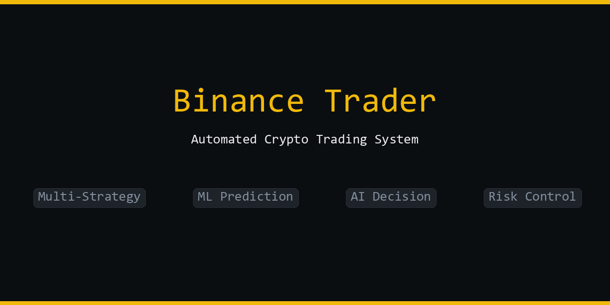

# Binance Trader



An automated cryptocurrency trading system built in Python, integrating multi-strategy engine, genetic algorithm optimization, ML prediction, AI decision-making, three-tier risk control, and a real-time web management panel.

## Architecture

```
binance_trader/
├── app/                          # Entry point, config, event bus
│   ├── main.py                   # Component initialization, dependency injection
│   ├── config.py                 # Singleton config loader (YAML → Pydantic models)
│   └── event_bus.py              # Async event bus (17 event types, 10000 capacity)
├── core/
│   ├── strategy/                 # Strategy engine
│   │   ├── engine.py             # Strategy evaluation, signal fusion (indicator + ML + news)
│   │   ├── loader.py             # YAML strategy CRUD (Pydantic models)
│   │   └── indicators.py         # TA-Lib technical indicators (RSI, MACD, BB, EMA, ADX, etc.)
│   ├── ga/                       # Genetic algorithm optimization
│   │   ├── evolver.py            # GA evolution engine: selection/crossover/mutation/elite
│   │   ├── genome.py             # Strategy↔chromosome encoding
│   │   └── fitness.py            # Fitness evaluation: Sharpe × win rate × stability
│   ├── market_data/              # Market data
│   │   ├── provider.py           # Binance WebSocket multi-stream + REST polling hybrid
│   │   └── ohlcv_cache.py        # Parquet + in-memory dual-layer OHLCV cache
│   ├── risk/                     # Risk control (3 tiers)
│   │   ├── manager.py            # 7-step signal approval pipeline
│   │   ├── circuit_breaker.py    # Drawdown / daily loss / consecutive loss trip
│   │   ├── position_guard.py     # 15s loop: trailing stop + emergency stop
│   │   └── position_sizer.py     # Position sizing, SL/TP calculation
│   ├── executor/
│   │   └── executor.py           # Order execution (sim memory + live Binance API, 3 retries)
│   ├── ml/                       # Machine learning
│   │   ├── predictor.py          # XGBoost binary classifier, real-time prediction
│   │   ├── trainer.py            # Model trainer (auto save/load)
│   │   └── features.py           # Feature engineering + label construction
│   ├── ai/                       # AI decision-making
│   │   ├── deepseek_ctl.py       # DeepSeek controller (4 background loops)
│   │   ├── prompts.py            # 5 AI prompt template groups
│   │   └── vibe_connector.py     # Vibe-Trading MCP integration
│   ├── auth/                     # Authentication & authorization
│   │   └── auth.py               # JWT + bcrypt + session + RBAC (3 roles)
│   └── news/                     # News analysis
│       ├── analyzer.py           # News fetching, sentiment, anomaly detection
│       ├── fetcher.py            # httpx async HTTP client (API + RSS)
│       └── source_manager.py     # News source config CRUD
├── web/
│   ├── server.py                 # FastAPI app factory (60+ routes, WebSocket, HTMX)
│   ├── i18n.py                   # Chinese/English translation (200+ entries)
│   └── templates/                # Jinja2 templates (9 pages + 9 partials)
├── alerts/
│   ├── manager.py                # Alert rule engine + DB persistence + WebSocket broadcast
│   └── rules.py                  # AlertRule dataclass, 5 default rules, JSON persistence
├── db/
│   └── database.py               # SQLite schema (13 tables), atomic balance operations
├── strategies/                   # Strategy YAML definitions
├── config/
│   ├── config.yaml               # Master config (AI mode, signal weights, news, allocation)
│   ├── risk_params.yaml          # Risk parameters (drawdown, position, stop limits)
│   ├── alert_rules.json          # Alert rule definitions (JSON format)
│   └── secrets.yaml              # Sensitive credentials (gitignored)
├── data/                         # Runtime data (DB, models, cache — all gitignored)
└── tests/                        # Test files
```

## Core Capabilities

### Event-Driven Architecture

17 event types enable loosely-coupled inter-component communication:

```
[Binance WebSocket] → MARKET_KLINE → [StrategyEngine]
[REST Polling]      → MARKET_KLINE ↗     ↓ STRATEGY_SIGNAL
[MLPredictor]       → ML_PREDICTION →   [RiskManager]
[NewsAnalyzer]      → NEWS_UPDATE   →       ↓ ORDER_REQUEST
                                          [OrderExecutor]
```

**Full event flow**:
1. `MARKET_KLINE` arrives → `StrategyEngine` computes indicators → fuses ML/news signals → publishes `STRATEGY_SIGNAL`
2. `RiskManager` approves signal (7-step pipeline) → publishes `ORDER_REQUEST`
3. `OrderExecutor` executes order → publishes `POSITION_UPDATE` → `RiskManager` updates positions
4. Exit signal → `POSITION_EXIT`/`POSITION_REDUCE` → close/reduce position
5. Circuit breaker trip → `RISK_BREACH` → AI decision / preset action

### Strategy Engine

- **Declarative YAML definitions** — strategies are fully described in YAML: indicator parameters, entry/exit conditions, partial-reduction rules, and timeframes
- **Signal fusion engine** — `(indicator×w_ind + ML×w_ml + news×w_news) / total_weight` with dynamic weight adjustment
- **Multi-timeframe** — any combination of 1m/5m/15m/1h/4h; short-term confirmation + long-term trend filtering
- **Strategy×Symbol matrix** — each strategy independently selects trading symbols; backtests measure per-cell performance
- **Web UI lifecycle management** — create, edit, toggle, and delete strategies from the browser without restarting

### Genetic Algorithm Strategy Optimization

- **Automated evolution** — initialize population → parallel backtest evaluation → selection/crossover/mutation → iterative improvement
- **Genome encoding** — continuous genes (indicator parameters) + categorical genes (mode/timeframes) + structural genes (entry/exit conditions)
- **Fitness function** — Sharpe ratio ×2 + win rate + profit factor − drawdown penalty − overfitting penalty
- **Anti-overfitting** — out-of-sample validation + complexity penalty + Deflated Sharpe Ratio
- **Checkpoint/resume** — evolution state persists to disk after each generation, survives restarts

### Machine Learning (3 engines)

- **LightGBM** — gradient-boosted trees, fast and stable (~3h full-matrix backtest)
- **TFT (Temporal Fusion Transformer)** — variable selection networks + LSTM + multi-head attention
- **PatchTST** — #1 ranked in 2026 benchmarks: patch embedding + Transformer encoder
- **Triple Barrier labels** — path-aware upper/lower/timeout classification, better than binary direction labels
- **37-dimensional features** — momentum, volatility, volume quality, price position, trend strength, micro-structure, time cycles
- **Round-robin retraining** — staggered: 1 model per step, avoids GPU burst overload

### AI Decision-Making (DeepSeek)

4 background loops, active only in `full_auto` mode:

| Task | Default Interval | Function |
|------|-----------------|----------|
| Market Assessment | 60 min | Analyze market conditions, BTC dominance |
| Coin Selection | 240 min | Recommend trading symbols, core/satellite allocation |
| Strategy Optimization | 1440 min | Analyze strategy performance, recommend parameter changes |
| Risk Adjustment | 1440 min | Evaluate risk exposure, adjust risk parameters |

Breaker recovery: AI evaluates every 5 minutes whether it's safe to resume trading.

### Three-Tier Risk Control

| Tier | Component | Check Frequency | Function |
|------|-----------|-----------------|----------|
| Tier 1 | CircuitBreaker | Every signal | Daily drawdown % / daily loss $ / consecutive losses |
| Tier 2 | RiskManager | Every signal | 7-step approval pipeline, signal dedup |
| Tier 3 | PositionGuard | Every 15 sec | Trailing stop updates + emergency force close |

### Alert Rule Engine

5 default rules with condition matching + cooldown:

| Rule | Event | Level | Cooldown |
|------|-------|-------|----------|
| Circuit Breaker | risk.breach | critical | 5 min |
| Emergency Stop | alert.trigger | critical | 1 min |
| AI Suggestion Pending | ai.suggestion | info | 5 min |
| News Emergency Fetch | news.alert | warning | 10 min |
| Signal Rejected | alert.trigger | warning | 5 min |

Real-time WebSocket push to frontend — no refresh required.

### Multi-User Authentication

- **admin**: Full access (trading, settings, user management, database)
- **trader**: Trading + settings (cannot manage users or DB)
- **viewer**: Read-only access (view dashboard and pages, cannot trade or modify settings)

Security features:
- bcrypt password hashing
- JWT (HS256) + session cookies
- HttpOnly + SameSite cookies
- API endpoint role verification
- JWT secret randomly generated at startup (only fingerprint hash logged)

## Quick Start

### 1. Install

```bash
cd binance_trader
pip install -r requirements.txt
```

> **Note**: TA-Lib requires system-level installation:
> - Windows: Download precompiled wheel from [ta-lib-python](https://github.com/TA-Lib/ta-lib-python)
> - macOS: `brew install ta-lib`
> - Linux: `apt-get install ta-lib`

### 2. Configure

```bash
cp config/secrets.yaml.example config/secrets.yaml
```

Edit `config/secrets.yaml`:

```yaml
binance:
  api_key: "your_binance_api_key"
  api_secret: "your_binance_api_secret"
deepseek:
  api_key: "your_deepseek_api_key"
```

Or via environment variables:

```bash
export BINANCE_API_KEY="your_key"
export BINANCE_API_SECRET="your_secret"
export DEEPSEEK_API_KEY="your_key"
```

### 3. Start

```bash
# Simulated trading (default)
python -m app.main --mode sim --port 8899

# Live trading
python -m app.main --mode live --port 8899
```

Visit `http://127.0.0.1:8899`.
On first startup, an admin account is auto-created — the password is printed in the terminal.

## Run Modes

| `--mode` | Description |
|----------|-------------|
| `sim` (default) | Simulated trading, local SQLite records, initial balance 10000 USDT |
| `live` | Live trading, connects to Binance Futures/Spot |
| `backtest` | Backtesting mode (in development) |

## AI Control Modes

Set in `config/config.yaml` → `ai.mode` or via Web UI:

| Mode | Signal Weights | Risk Parameters | Order Execution | Breaker Recovery |
|------|---------------|-----------------|-----------------|------------------|
| `suggest` | Manual | Manual | Manual confirm | Preset action |
| `semi_auto` | AI-adjusted | Manual | Manual confirm | Preset action |
| `full_auto` | AI auto | AI auto | AI auto | AI-decided |

## Risk Parameters

Configure in `config/risk_params.yaml` or Web UI settings:

| Parameter | Default | Description |
|-----------|---------|-------------|
| `max_daily_drawdown_pct` | 7.5% | Max daily drawdown before breaker trip |
| `max_daily_loss_usdt` | 600 | Max daily loss before breaker trip |
| `max_consecutive_losses` | 5 | Consecutive losses triggering breaker |
| `max_open_trades` | 15 | Max simultaneous open positions |
| `max_position_size_pct` | 10% | Max single position % of balance |
| `max_leverage` | 3 | Max leverage multiplier |
| `trailing_stop_distance_pct` | 2.0% | Trailing stop distance from current price |
| `emergency_stop_threshold_pct` | -5.0% | Emergency stop threshold (unrealized PnL%) |
| `circuit_breaker_action` | block_only | Semi-auto breaker action (block_only / tighten_stops / close_all / close_worst) |

## API Endpoints (60+)

### Trading
`POST /api/trade` `POST /api/trade/close/{symbol}` `GET /api/price/{symbol}` `GET /api/kline/{symbol}` `GET /api/trades`

### Strategy Management (trader+)
`GET/POST/PUT/DELETE /api/strategy/{name}` `POST /api/strategy/{name}/toggle` `POST /api/strategy/reload`

### AI Control (trader+)
`GET /api/ai-suggestions` `POST /api/ai-suggestions/{id}/approve|reject` `POST /api/ai-mode` `POST /api/consult`

### Alerts
`GET /api/alerts` `POST /api/alerts/{id}/ack` `POST /api/alerts/clear` `WS /ws/alerts`

### Settings (trader+)
`POST /api/settings/deepseek|binance|risk|ai-news`

### User Management (admin)
`GET/POST /api/users` `POST /api/users/{id}/toggle`

### DB Manager (admin)
`GET /api/db/table/{table}` `GET /api/db/backup|export` `POST /api/db/restore|optimize|cleanup`

### Dashboard
`GET /partials/stats|positions|trades|alerts|ai-suggestions`

## Tech Stack

| Category | Technology |
|----------|------------|
| Language | Python 3.11+ |
| Async Runtime | asyncio |
| Market Data | python-binance (WebSocket multi-stream + REST) |
| Web Framework | FastAPI + Jinja2 + HTMX + ECharts |
| Database | SQLite (aiosqlite) + Parquet (pyarrow) |
| ML | LightGBM + PyTorch (TFT, PatchTST) |
| AI | OpenAI SDK → DeepSeek API |
| Technical Indicators | TA-Lib |
| Auth | bcrypt + PyJWT (HS256) |
| Serialization | Pydantic + YAML + JSON |

## Testing

```bash
cd tests
python -m pytest test_event_bus.py test_config.py test_database.py -v
```

13 test files covering core components: event bus, config loading, database operations, market data, strategy engine, risk management, order execution, news analysis, ML prediction, AI decisions, alert system, and integration tests.

## License

MIT License
